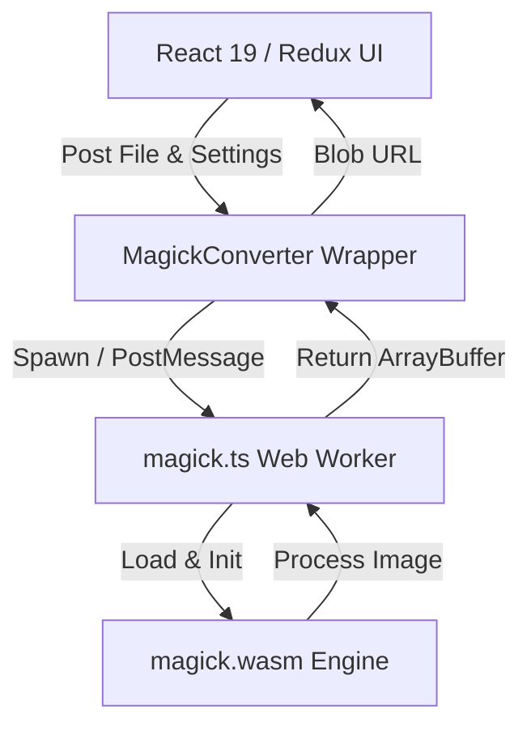

# Chng

Chng is a premium, client-side, local-first image processing toolkit. It enables professional-grade format conversion and target-size image compression directly in the browser. No files ever leave your machine — everything runs locally in WebAssembly.

---

## 🚀 Technology Stack

- **Core**: React 19 (declarative component model) & TypeScript (strict type safety)
- **State Management**: Redux Toolkit (independent state slices for Converter and Compressor)
- **Styling**: Tailwind CSS v3 + Sass (SCSS)
  - Styled with a premium **monochrome 60-30-10 palette** (60% background, 30% panels/cards, 10% electric blue contrast accent)
- **Typography**: Geist Sans & Geist Mono (via Fontsource)
- **Execution Engines**:
  - **ImageMagick WebAssembly (`@imagemagick/magick-wasm`)** running inside dedicated Web Workers for fast, concurrent processing without blocking the UI thread
  - **Client Zip / Fflate** for instant, client-side ZIP packaging of batch outputs
- **PWA & Offline Capability**: Service Worker caching of large assets (`magick.wasm` and worker scripts) for instant loading

---

## 🛠 Features

### 1. Format Converter
- **Supported Formats**: JPG, JPEG, PNG, WebP, GIF, SVG, BMP, ICO, CR2, NEF, DNG, TIFF, and other raw/modern image formats.
- **ZIP Extractions**: Drop or upload a `.zip` archive, and Chng will automatically extract, detect, and convert all images.
- **Batch Processing**: Convert multiple images concurrently with worker concurrency managed relative to system hardware capacity.

### 2. Image Compressor
- **Target Size Optimization**: Specify your target file size (e.g., `150 KB` or `2 MB`), and the algorithm will automatically adjust quality and dimensions to meet it.
- **Iterative WASM Compression Algorithm**:
  - Starts from a user-configured quality slider value.
  - Clones the image in WASM memory.
  - Scales/resizes and strips metadata iteratively.
  - Reduces quality by `8%` per iteration, and drops scale by `5%` if quality drops below `15%`, until the target file size is reached or limits (`scale < 20%` or `quality < 10%`) are hit.
- **Format Automatic Fallbacks**: PNG, BMP, and GIF are converted to JPEG to support lossy compression limits.

### 3. Studio Toolkit (Design Tools)
- **Brand Guidelines**: Procedurally generate sleek, responsive brand guidelines boards. Upload a logo, pick a brand personality, and generate curated typography and color palettes (using OKLCH).
- **Logo Grid Designer**: A designer-grade tool to overlay geometric composition grids on logos. 
  - Supports **Standard Grid**, **Golden Ratio (Phi)** divisions, and true **Golden Spiral** (nested Fibonacci rectangles).
  - High-res vector exports (PNG and transparent SVG).
- **Mockup Generator**: An impeccable, local-first mockup generator.
  - Generates top-tier photographic-quality Flat 2D mockups without any network uploads.
  - **Award-Winning Styles**: Choose between **Floating Glass Card** (a sleek floating pane with a 1px glass rim and massive drop shadow), **Safari Window**, and **Clay Mobile** (a sleek solid-color iPhone silhouette with deep inner bevels).
  - **Custom Backgrounds**: Upload your own background images and perfectly map them with Cover, Contain, or Tile fit modes, or use the procedural editorial meshes.
  - Exports to 4K or Transparent PNG.

---

## 🏗 Architecture

Chng operates entirely client-side. The image processing is offloaded to Web Workers using WebAssembly:



1. **MagickConverter** initializes by pre-fetching and caching `magick.wasm` (14MB).
2. When a file is scheduled, a dedicated worker (`magick.ts`) is spawned.
3. The raw file bytes are transferred to the worker thread via `ArrayBuffer` transferables.
4. The worker processes the image in WASM memory, writes it to a buffer, and returns the result.
5. The UI converts the returned buffer into an object URL for preview and download.

---

## 💻 Getting Started

### Prerequisites
- Node.js (v18 or higher)
- npm or yarn

### Installation
1. Clone the repository:
   ```bash
   git clone <repository-url>
   cd Chng
   ```
2. Install dependencies:
   ```bash
   npm install
   ```

### Development
Start the local Vite dev server:
```bash
npm run dev
```

### Production Build
Build the optimized application bundle:
```bash
npm run build
```
Preview the production build locally:
```bash
npm run preview
```

---

*Chng: Private, fast, local-first image processing.*
