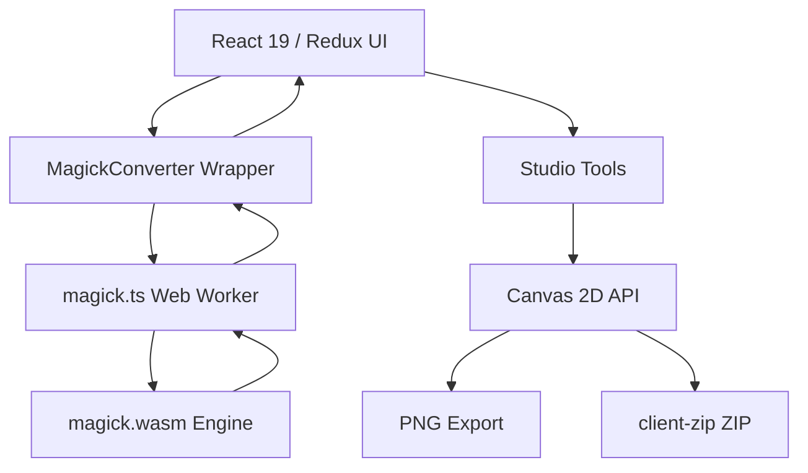

# Chng

Chng is a premium, client-side, local-first image processing toolkit and design studio. Format conversion, compression, and professional branding tools — all running directly in the browser. No files ever leave your machine.

---

## 🚀 Technology Stack

- **Core**: React 19 + TypeScript (strict)
- **State**: Redux Toolkit (independent slices for Converter, Compressor, Settings)
- **Styling**: Tailwind CSS v3 + Sass (SCSS) + shared `lg-*` design system (`logo-grid.css`)
  - Premium monochrome palette — 60% background / 30% panel / 10% accent
- **Typography**: Geist Sans, Geist Mono, Geist Pixel Circle (via Fontsource)
- **Processing Engines**:
  - **ImageMagick WebAssembly** (`@imagemagick/magick-wasm`) inside Web Workers
  - **Canvas 2D API** for all Studio rendering (mockups, grids, logo pack)
  - **client-zip + fflate** for client-side ZIP packaging
- **Routing**: React Router v6 (hash-free, SPA)
- **PWA / Offline**: Service Worker caches `magick.wasm` and worker scripts

---

## 🛠 Features

### 1. Format Converter
- **Supported Formats**: JPG, PNG, WebP, GIF, SVG, BMP, ICO, CR2, NEF, DNG, TIFF, and other raw/modern formats.
- **ZIP Extraction**: Drop a `.zip` archive — Chng extracts, detects, and converts all images inside.
- **Batch Processing**: Concurrent worker pool sized relative to hardware concurrency.
- **Drag & Drop + Paste**: Drop files anywhere or paste from clipboard.

### 2. Image Compressor
- **Target-Size Optimization**: Set a target (e.g. `150 KB`) — the algorithm adjusts quality and scale to hit it.
- **Iterative WASM Algorithm**:
  - Starts at user-configured quality.
  - Reduces quality `8%` per step; drops scale `5%` if quality < 15%.
  - Stops when target is reached or hard limits (scale < 20%, quality < 10%) are hit.
- **Format Fallbacks**: PNG/BMP/GIF are auto-converted to JPEG for lossy compression.

### 3. Studio — Design Toolkit

All Studio tools share the same `lg-shell` layout system: consistent topbar, breadcrumb, scrollable sidebar, and export bar.

#### Brand Guidelines
Generate polished brand guidelines boards in seconds.
- Upload a logo, pick a brand personality, and receive a curated color palette (OKLCH) and typography pairing.
- Export to high-quality PDF.

#### Logo Grid Designer
A designer-grade geometric construction overlay tool.
- **Grid modes**: Standard Grid, Golden Ratio (Phi) divisions, true Golden Spiral (nested Fibonacci rectangles), Clearspace zones.
- Live interactive canvas. Export to high-res PNG or transparent SVG.

#### Mockup Generator
Local-first, zero-upload premium device mockups.
- **Device styles**: Floating Glass Card (1px glass rim + deep shadow), Safari Browser Window, Clay Mobile (iPhone silhouette with inner bevels).
- **Backgrounds**: Upload your own image (Cover / Contain / Tile fit), or choose from procedural editorial mesh gradients.
- **Canvas ratios**: 16:9, 4:3, 1:1, 9:16 portrait.
- **Effects**: Screen glare toggle, ambient shadow toggle, adjustable corner radius (Glass Card).
- Export to **4K PNG** or **Transparent PNG**.

#### Logo Pack Generator ✦ New
One-click export of every logo asset a project needs — packaged as a production-ready ZIP. All processing is client-side.

**What's in the ZIP:**

| Category | Files |
|---|---|
| Favicons | `favicon.ico` (16+32+48px multi-size), `favicon.svg`, `favicon-16x16.png`, `favicon-32x32.png`, `favicon-48x48.png` |
| Apple & PWA | `apple-touch-icon.png` (180px), `icon-192.png`, `icon-512.png`, `icon-maskable-512.png` |
| Open Graph & Social | `og-image.png` (1200×630), `twitter-card.png` (1200×628) |
| SVG Variants | `logo-dark.svg`, `logo-light.svg`, `logo-mono-black.svg`, `logo-mono-white.svg` |
| PNG Variants | `logo-dark@1x.png`, `logo-dark@2x.png`, `logo-light@1x.png`, `logo-light@2x.png` |
| Manifest & Config | `site.webmanifest` (pre-filled), `browserconfig.xml`, `README.md` with HTML snippet |

**Key features:**
- Accepts **SVG** (full pack) or **PNG/JPG/WebP** (PNG outputs only, SVG-only files skipped with clear badge).
- **SVG recolouring**: fills/strokes rewritten per variant — full control over dark fill, light fill, mono-black, mono-white.
- **ICO generation**: multi-size (16+32+48px) `.ico` built client-side using PNG-embedded ICO format.
- **OG Image drawing**: Canvas-rendered with logo, dynamic project name, optional tagline, layout modes (Centered vs Padded), and modern flat backgrounds.
- **Live preview grid**: all 20+ thumbnails render in real time with dynamic SVG recolouring, auto-adjusted backgrounds, and aligned layout badges.
- **Interactive contrast controls**: a quick-toggle toolbar (Auto/Light/Dark) to inspect transparency against different surfaces.
- **Progress bar**: specific step messages during ZIP generation.

---

## 🏗 Architecture

Chng is fully client-side. Image processing runs in Web Workers; Studio rendering uses Canvas 2D.



1. **MagickConverter** pre-fetches and caches `magick.wasm` (14 MB) via Service Worker.
2. Each file spawns a dedicated `magick.ts` worker; bytes transferred via `ArrayBuffer` transferables.
3. Studio tools use pure Canvas 2D — no server, no WASM, no external deps beyond `client-zip`.

---

## 💻 Getting Started

### Prerequisites
- Node.js v18+
- npm

### Installation
```bash
git clone <repository-url>
cd Chng
npm install
```

### Development
```bash
npm run dev
```

### Production Build
```bash
npm run build
npm run preview
```

---

## 🎨 Design System

All Studio tools use the shared `lg-*` CSS system defined in `src/lib/css/logo-grid.css`:

| Class | Purpose |
|---|---|
| `lg-shell` | Full-viewport tool container |
| `lg-topbar` | Fixed top nav with logo + breadcrumb |
| `lg-breadcrumb` | `Studio / Tool Name` navigation |
| `lg-body` | Flex row: sidebar + main |
| `lg-sidebar` | Scrollable left controls panel |
| `lg-main` | Right canvas/preview area |
| `lg-canvas-wrap` | Padded canvas container |
| `lg-export-bar` | Bottom action bar |
| `lg-section` | Animated sidebar section group |
| `lg-toggle` | Accessible switch toggle |
| `lg-dropzone` | File upload drop target |

---

## 🔒 Privacy

- **Zero uploads.** All processing — conversion, compression, mockup rendering, logo pack generation — happens locally in the browser.
- **No analytics by default.** Optional Plausible integration (self-hosted) configurable via `VITE_PLAUSIBLE_URL`.
- **No cookies, no tracking.**

---

*Chng — Private, fast, local-first image processing and design studio.*
